## Qwiklabs Assessment: Utilizing Active Directory

### Learning Objectives

- Getting familiar with Active Directory

- Applying a global policy with Active Directory

- Creating groups and managing accounts with Active Directory

### Introduction

Active Directory is a core tool for System Administrators that need to manage Windows machines.  Active Directory allows to manage users, groups, machines, and the policies that apply to all of them in a centralized fashion.


### What you’ll do

In this lab, you'll interact with Active Directory, use it to add users and groups, edit users memberships as well as create a new group policy object (GPO).


## Installing and Configuring Active Directory


First, you will need to install and ``configure Active Directory``. This is a complicated process, so we have provided PowerShell scripts to automate most of it. Please follow the following instructions carefully.

After logging in, open <b>Windows Powershell</b> as an Administrator. You can open <b>Windows Powershell</b> as an Administrator by opening the Start Menu, right-clicking the <b>Windows Powershell</b> icon and selecting <b>More</b>, then <b>Run as Administrator</b>.


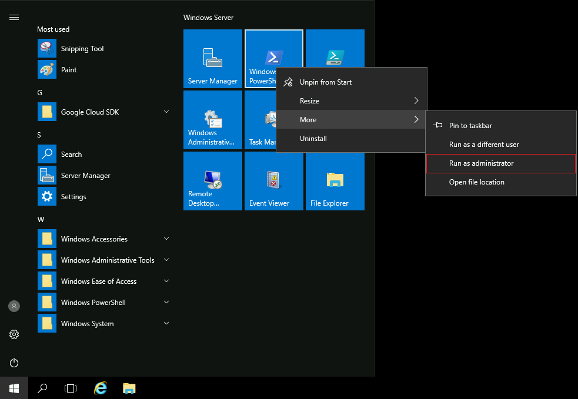

In Windows PowerShell, run the following command to <b>install Active Directory:</b>


```
C:\Qwiklabs\ADSetup\active_directory_install.ps1
```

This will run for a couple of minutes. It will print a few warnings, but don't worry, those are expected. When it's done, the script will pop-up a message indicating that it will restart the computer.


After successfully installing <b>Active Directories</b>, the Windows VM automatically disconnects, and it will display the <b>RDP connection</b> panel (shown below):

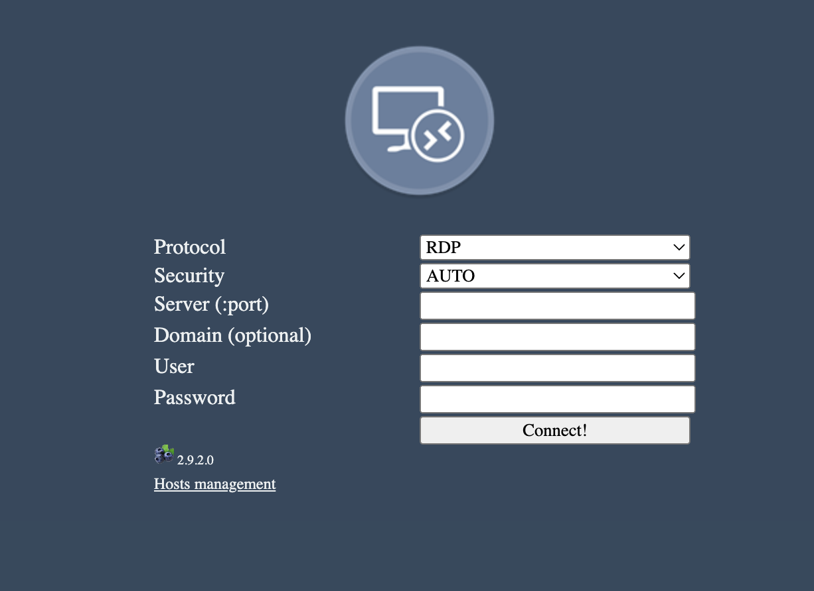

There is no need to enter any information at this point. Simply close this current tab and return to the lab page. Click on <b>Open Windows VM</b> again, and it will reconnect you to the same <b>Windows VM</b>. This will preserve your previous activity, and you don’t need to re-run the <b>Active Directory</b> Installation command again.


Active Directory has now been installed, but it still needs to be configured. This should be simpler than the previous task. Open <b>Windows Powershell</b> as an Administrator and run the following command to configure Active Directory and continue with the rest of the lab when it finishes:

```
C:\Qwiklabs\ADSetup\configure_active_directory.ps1
```

## Managing Users and Groups

Once the above setup is done, you are now ready to experiment with Active Directory.

Open the <b>Active Directory Administrative Center (ADAC)</b>. You can find it by typing ``"active"`` into the Windows start menu.

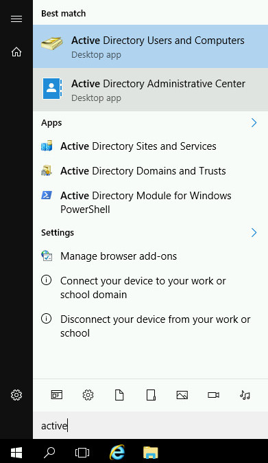


The <b>Active Directory Administrative Center</b> allows you to manage your Active Directory installation, by configuring users, groups, computers, and more. Feel free to browse around the resources that already exist in the directory.


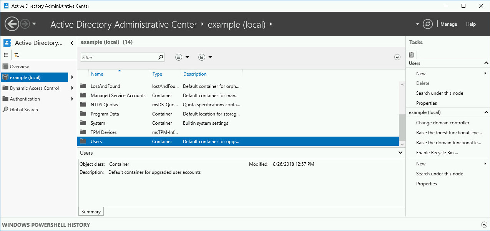

For this lab, we want to create a new user called <b>Alex</b>. To do that, first click on the <b>example (local)</b> entry. This is the entry for the domain that your account can manage. Then scroll down and double click on the <b>Users</b> entry to see the list of users and groups that currently exist.

<b>Adding User</b>

To create a <b>new user</b>, take a look at the tasks list on the right. Under the <b>Users</b> section, there's a <b>New</b> menu entry, which opens a submenu to select what's the type of entity that you want to create. In this case, we want to create a new user, so click on the <b>User</b> option.

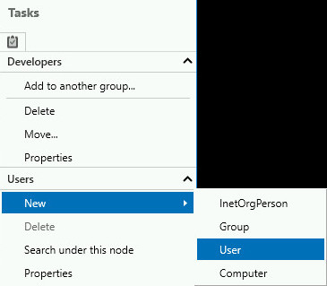


This will open a new window that lets you fill in a number of fields related to the new user. There are a lot of fields available, but only a couple are mandatory (indicated with the red star). You can leave the rest empty. The user that we are creating is called <b>Alex</b>, with their username being also <b>alex</b>.


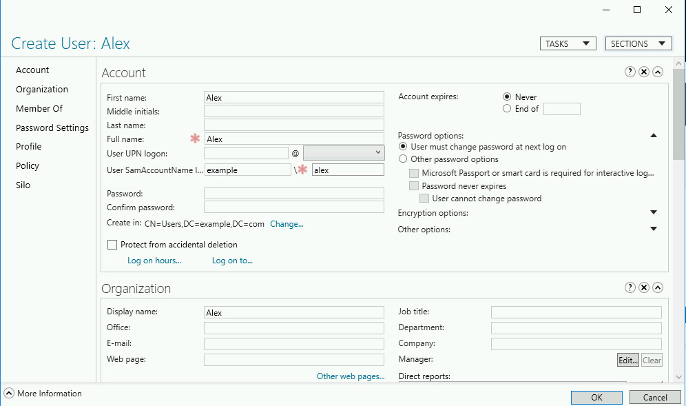

Once you've entered the necessary data, click the <b>OK</b> button to have the user created.

If you click on the newly created account, you will see that where it displays the name of the user, the system says <b>Alex (Disabled)</b>.

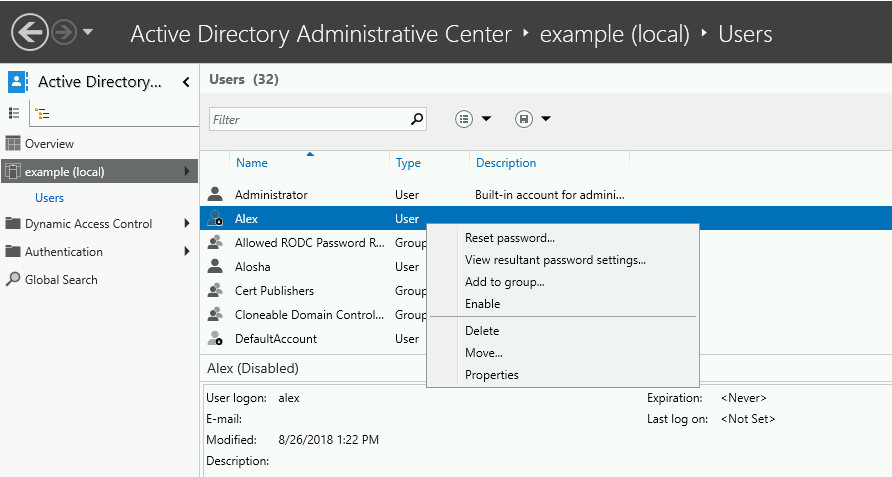

What happens if you right click on the entry and try to <b>Enable</b> it?


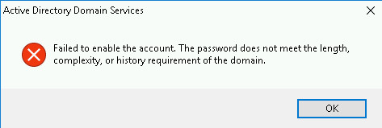


The system will not enable an account that doesn't have a good password. In this case, the password is empty because we haven't set it. Obviously, an empty password is not a good password.

You can set a password using the <b>Reset password</b> menu option.


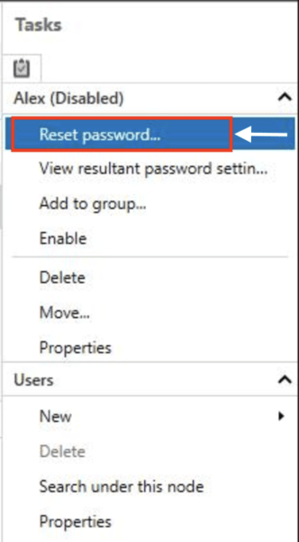

Enter the password and confirm password into the Reset Password window, and <b>User must change password at next logon</b>option is already checked, we ensure that the user will change their password when they log in. So now click on the <b>OK</b> button to set the password. The goal of this is that after they've logged in once, the system administrator will not know their new password.

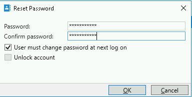


Once you've set a good password, you can retry enabling the account. This time it should work

### Adding groups


Let's now add a <b>new group</b>. If you browse through the existing groups, you will see that there's a group called ``Developers`` and a group called ``Java Developers``. We now want to add an additional group, called <b>Python Developers</b>. Add the new group to the Developers group, then add the account we just created for Alex to the Python Developers group.

To create a new group, use the same menu that you used for creating a new user, but this time select the new <b>Group</b> option.

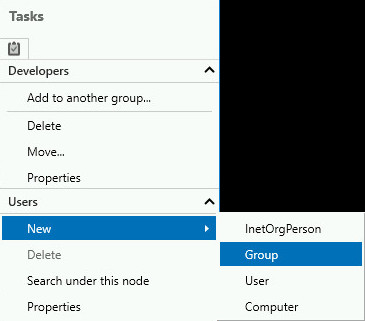

This will open a similar window to the one that we saw before, but this time it requires the data for the ``Group`` rather than the ``user``.

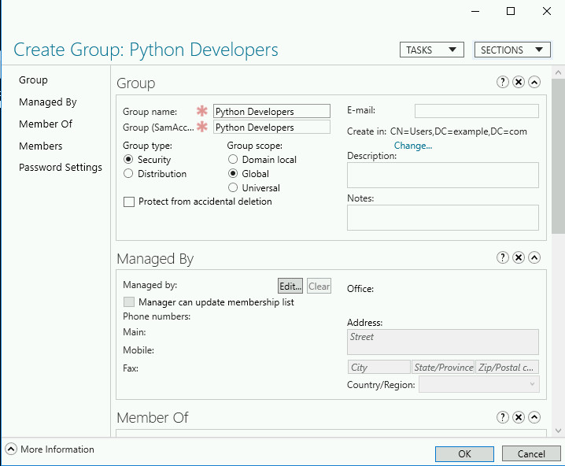

We are creating a group called <b>Python Developers</b> and that's the only data that is mandatory. You can also add additional information in the <b>Description</b> and <b>Notes</b>, if you want. Once you are done, click <b>OK</b> to have the group created.

### Adding entities to groups

We have a ``Python Developers`` group, now we want to add it to the ``Developers group`` that already exists. We can do this by scrolling down to the new entry and then right clicking on the entry in the list and selecting the <b>Add to another group</b> entry.

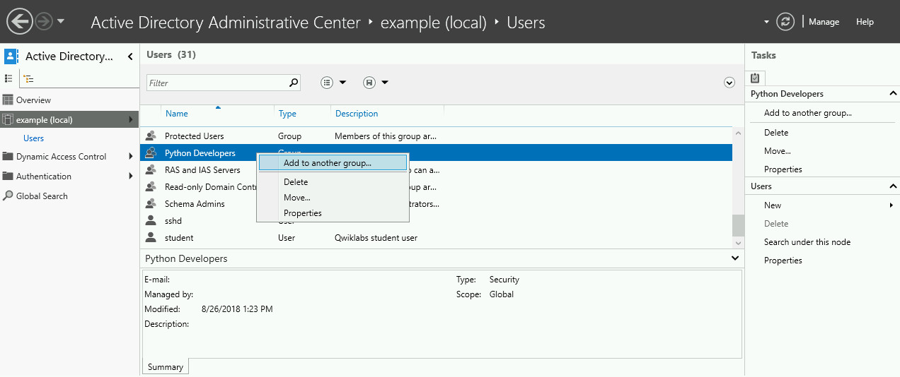

This will open a small window where we need to enter the name of the group. In this case, the group is called <b>Developers</b>.


You can use the <b>Check Names</b> button to verify that you have entered the name correctly. If you have, it will underline the text. If the name is incorrect, it will show a window saying "Name Not Found."

Clicking the <b>OK</b> button will add the ``Python Developers group`` to the ``Developers group``. We now want to do the same for adding ``Alex`` to ``Python Developers``. But we'll follow a different path.

In this case, we will double click the <b>Python Developers</b> entry in the list, which will open up an editing window for the group.


You can scroll down until you find the <b>Members</b> section of this window, or you can click on the <b>Members</b> link on the left. This section allows us to manually add or remove members from the group.


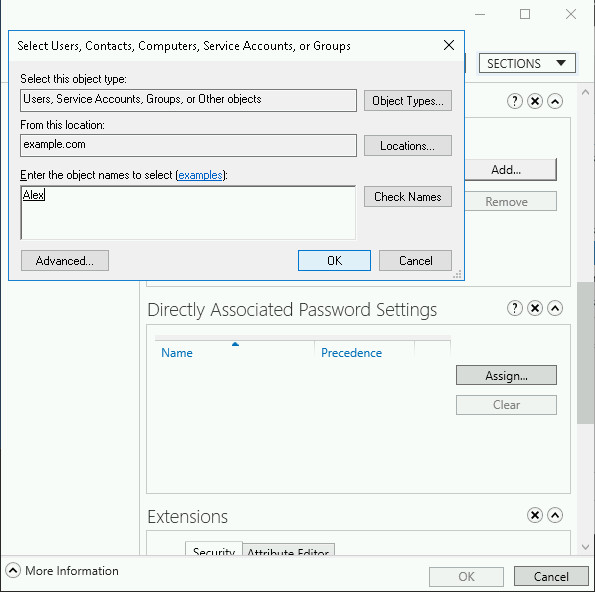


In this case, what we want to do is to add <b>Alex</b> to the group, so click the <b>Add</b> button, enter Alex in the text field and then <b>OK</b> for the addition and <b>OK</b> for saving the changes. We've successfully added a new member, Alex, into the Group!